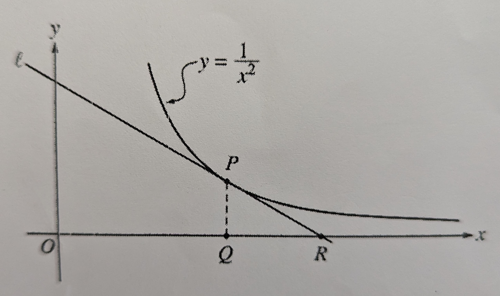

# Test 4 Questions

## Test Topics

- L'Hospital
- Absolute Extrema
- Related Rates
- Optimizations

### 45 - **L'Hospital's Rule**

_Lesson_

1. Restate L'Hospital's Rule
          

2. What are the the caveats for the application of L'Hospital's Rule?
          

3. Solve the following problems

   1. $\lim_{x \to \infty}{\frac{\sin x}{x}}$
         
   2. $\lim_{x \to 0}{\frac{1-\cos{x}}{x^2}}$
         
   3. $\lim_{x \to 1^-}{\frac{e^{x-1 - 1}}{(x-1)^4}}$
         
   4. $\lim_{x \to \infty} {\frac {\frac{1} {x ^{\frac{4}{3}}}}{\sin{\frac{1}{x}}}}$
         
   5. $\lim_{t \to 0}{\frac{e^{2t} - 1}{\sin t}}$
         
   6. $\lim_{x \to 0} {\frac{\sin^{-1}{(x^2 - x)}}{x}}$
         
   7. $\lim_{\theta \to {\pi \over 2}}{\frac{1-\sin\theta}{1+\cos2\theta}}$
         

4. Questions for Indeterminate Forms (46 and 47)
   Identify the indeterminate form and use L'Hospital's Rule to evaluate the limit.
   1. $\lim_{x \to 0^+}{\frac{\ln(x)}{1 \over x}}$
         
   2. $\lim_{x \to 0^+}{\frac{\ln(x)}{\csc(x)}}$
         
   3. $\lim_{x \to 0^+}{\tan{x} \ln{x}}$
         
   4. $\lim_{x \to \infty}{(x-\ln(x^2+1))}$
         
   5. $\lim_{x \to 1}({\frac{x}{x-1} + \frac{1}{\ln x}})$
         
   6. $\lim_{x\to{0^+}}{x^x}$
         
   7. $\lim_{x\to{0^+}}{x^{\sqrt{x}}}$
         
   8. $\lim_{x\to{0^+}}{(\tan{x})^x}$
         
   9. $\lim_{x\to\infty}{(1+1\over x)^x}$
         
   10. $\lim_{x\to{0^+}}{(\ln{x})^x}$
          

_Homework Questions I Got Wrong_

1. (45) $\lim_{x\to{0^+}}{\cot(x)\over\ln(x)}$
      

2. (47) $\lim_{x\to\infty}{(\ln{x})^{1\over x}}$
      

### 52 - **Absolute Extrema**

_Lesson_

1. What is the the Extreme Value Theorem
          
      

2. How does one justify local and absolute extrema?
       

3. Find the absolute maximum and minimum of $f(x) = 3x^{1\over3}(2x-1)$ on the interval $[-1,1]$. Justify your ansewer.
          
          

#### Questions from **53** - _More Absolute Extrema_

1. Find the absolute extrema of $f(x) = \ln{|x^2-4|}$ on the interval $[-1,1]$.
            
2. How should one approach finding the absolute extrema of a function on an unbounded / closed interval?
            
3. Find the absolute extrema of $f(x) = -x^5+3x-9$ on the interval $[-3, 4)$.
            
4. Find the absulute extrema over the following intervals

   1. $f(x) = \frac{x-2} {x+1}$ on $[-1, 5]$
               

   2. $f(x) = e^{x^{(x^3-3x^2)}}$ on $[0, \infty]$
               

_Homework I got Wrong_

1. (52) $f(x) = x-2\sin(x)$ on $[-\frac{\pi}{4},\frac{\pi}{2}]$
            

2. (53) $f(x) = 2x^3-6x+2$ on $[-\infty, \infty]$
            

### 54 - **Related Rates**

_Lesson_

1. What is the process for solving related rates problems?
          

2. Solve the following problems

   1. Oil leaking from a tanker spills into the ocean in a circular fashion. the area of the spill increases at a constant rate of $100 \frac{ft}{s}$. How fast is the radius of the increaseing when the area is $40,000 ft$?
             
             

   2. A baseball diamond is a square whose sides are $90 ft$ long. A player runs from second base to third base at a rate of $30 \frac{ft}{s}$ the instant he is $20 ft$ from 3rd base. At what rate is the player's distance from home plate changing?
             
             

3. Questions from **55** - _More Related Rates_

   1. A camera is 3000 feet away from a rocket launching pad. Seconds after launch the rocket is rising at $800 \frac{ft}{sec}$ at the moment it is $4000 ft$ away from the pad. How fast is the elevation angle changing at that moment?
             
             

#### Questions from **56** - _Even More Related Rates_

1. In the figure below, line $l$ is tangent to the graph of $y=\frac{1}{x^2}$ at point $P$, with coordinates $(w, \frac{1}{w^2})$. Point Q has coordinates $(w, 0)$. Line $l$ crosses the x-asis at point $R$, with coordinates $(k,0)$.

    

   1. Find the value of $k$ when w = 3.
             
   2. For all $w > 0$, find $k$ in terms of $w$.
             
   3. Suppose that w is increasing at a constant rate of 7 units per second. When $w = 5$, what is the rate of change of $k$ with respect to time?
             
   4. Suppose that w is increasing at a constant rate of 7 units per second. When $w=5$, what is the rate of change of the area of $\Delta PQR$ with respect to time? Determine whether the area is increasing or decreasing a that instant.
             

2. A circle is inscribed in a square. The circumference of the circle is increasing at a constant rate of 6 inches per second. As the circle explands, the square expands to maintain the condition of tangency. (Area: $A = \pi r^2$, Circumderence: $A = 2\pi r$).

   1. Find the rate at which the perimeter of the square is increasing. Include units of measure.
             
   2. At the instant when the area of the circle is $25\pi$ square inches, find the rate of the increase in the area enclosed betwen the circle and the square. Include units of measure.
             

3. The radius $r$ of a sphere is increasing at a constant rate of 0.04 centimeters per second. (Volume with radius $r$ is $V = \frac{4}{3} \pi r^2$)/
   1. At the time when the radius of the sphere is 10 centimeters, what is the rate of increase in its volume?
             
   2. At the time when the volume of the sphere is $36\pi$ cubic sentimeters, what is the rate of increase of the area of a cross scetion through the center of the sphere.
             
   3. At the time when the volume and radius of the sphere is increasing at the same numerical rate, what is the radius of the sphere?
             

_Homework I got Wrong_

1. (55) Let $\theta$ (in radians) be an acute angle in a right triangle and let x and y respectively be the length of the adjacent to and opposite $\theta$. Suppose also that x and y vary with time.
   1. How are $\frac{\delta \theta}{\delta t}$ related?
             
   2. At a certain instant, x = 2 and is increasing $1 \frac{unit}{s}$, while y = 2 units and is decreasing at ${1 \over 4} \frac{units}{s}$
             

### 59 - **Optimizations**

1. What is the general process for solving optimization problems, and how is its applicability different than for other problems.
          
2. A rectangular garden is to enclosed by a fence. What is the largest possibile area that can be enclosed if only 100 ft of fence is available?
               
3. A lidless box is to be formed by a 16 x 30 in piece of cardboard by cutting out squares of equal size from the corners and bending up the sides. What size squares should be cut out to maximize the volume of the box?
               

4. An offshore oil well needs to transfer its crude oil to a refinery that is 8km down the shorline that us 8km down the shoreline. The well is 5km from shore. The cose of laying pipe is $1M/km under water and 500k/km over land. What path should the pipe take to minimize the cost of the pipe?
               

#### Questions from 60 - More Optimizations

1. Find the radius and height of the largest cylinder (by volume) that can be incribed on a cone with radius 6in and height 10in.
               
2. Find the point in the curve $y = x^2$ closest to the point (18,0).
               

##### Questions from 61 - Even More Optimizations

1. Find the x-coordinate of the point on the parabola $y = 1-x^2$, $0<x<1$, where the triangle enclosed by the tangent line at $P$ and the coordinate axes have the smallest area.
                    
2. A trapeziod is inscribed in a semicircle of radius 2 so that one side is along the diameter. Find the maximum possible area. [Hint: Express area in terms of $\theta$]
                    

#### Questions from 62 - Even More Optimizations

1. The lower edge of a painting which is 6ft in height and 3 feet above an observer's eye level. Assuming the best view is obtained with the angle subtended by the viewer's eye by the painting is greatest, how far from the wall should the observer stand?
                    
2. A hallway five feet wide meets another hallway 7 ft wide to form a corner. What is the length of the longest ladder that can be carred around the house.
                    
3. A plant is used to reach over a fence 8 ft hight to support a wall that is 1 ft behind the fence. What is the length of the shortest plan that can be used?
                    
4. A circular lake is a circle with diameter 2mi. Nancy's training routine begins at point E on the eastern shore of the lake. She jogs along to the north shore to a point p and swims the straight line distance, if any, from point p to point w diametrically opposite E. Nancy swims at a rate of 2mi/hr and jogs at a rate of 8mi/hr. What is (a) the shortest and (b) the greatest amount of time she can take.
                    
5. A commercial cattle rance currently allows 20 steers per acre of grazing land on the average its steers weigh 2k lbs. Per cow added, the average weight of the cows decreases by 50 lbs. How can one find the max cow weight.
                    
6. Given points A(2,1) and B(5,4), find the point P in the interval [2,5] on the x-axis such that maximizes $\angle APB$.
                    

_Additional Random Worksheet_

1. A particle is moving along a curve whose equation is $$\frac{xy^3}{1+y^2} = \frac{8}{5}$$. Assume that the x-coordinate is increasing at a rate of 6 units/s when the particle is at the point (1,2).
   1. At what rate is the y-coordinate of the point changing at that instant?
                       
   2. Is the particle rising or falling at that instant?
          
2. Water is stored in a cone shaped reservioir (vertex down). Assuming the water evaporates at a rate proportional to the surface area exporsed to the air, show that the depth of the water will decrease at a constant rate that does not depend on the dimensions of the resevoir.
                       
3. A meteor enters the Earth's atmosphere and burns up at a rate that, at each instant, is proportional to its surface area. Assuming that the meteor is always spherical, show that the radius of the meteor decreases at a constant rate.

_Homework I got Wrong_

1. (59) A rectangular plot needs to be fenced with two kinds of fencing. Two opposite sides will use heavy duty fencing at $3 a foot while the other remaining two sides will $2 a foot. What are the dimensions of the plot with the largest area that can be fenced for $6000?
                 
2. (59) Suppose a number of bacteria given in a culter at time t is given by $N = 5000(50+te^{-t\over 20})$.
   1. find the longest + smallest number of bacteria over time 0 ≤ t ≤ 100.
                   
   2. Find the time when the number of number of bacteria is increasing the largest.
                   
3. (61) Where on the curve of $y=(1+x^2)^{-1}$.
                
