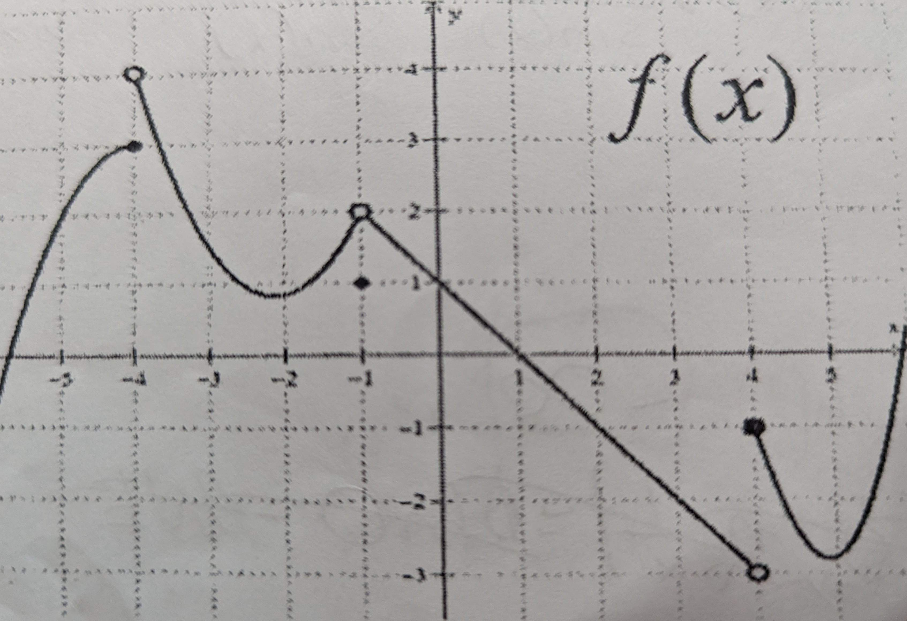

Use the formal definition of limits to prove that the following are true

1. $\lim_{x \to 4}{x^2 + 3x + 1} = 29$
2. $\lim_{x \to -\infty}{\frac {1}{(x+11)^2}}=0$

3. Sketch a Graph of the following functions. Then use that graph to evaluate that function's limit.
   1. $\lim_{x \to -\infty}{\tan^-1(x)}=$
   2. $\lim_{x \to -\infty}{e^{-x}}=$
   3. $\lim_{x \to 0}{\ln(x)}=$
   4. $\lim_{x \to \pi^-}{\cot(x)}=$

Questions 4 to 7 refer to the function graphed function.

4. $\lim_{x \to -4^-}{f(x)}=$
5. $\lim{x \to -4^+}{f(x)}=$
6. $\lim_{x \to -1}{f(x)}=$
7. $\lim_{x \to 4}{f(x)}=$

Evaluate the following limits

8. $\lim_{x \to \infty}{3x^2-8x^5}=$
9. $\lim_{x \to -3}{\frac{x^2-2x+1}{3x-1}}=$
10. $\lim_{x \to 5}{\frac{-3}{x-5}}=$
11. $\lim_{x \to 1}{\frac{8x^5+8x^3+8x}{2x^6+2x^4}}=$
12. $\lim_{x \to -\infty}{\frac{^6\sqrt{12x^5}}{^5\sqrt{x^3-1}}}=$
13. $\lim_{x \to 2^+}{\frac{x+2}{2-x}}=$
14. $\lim_{x \to \infty}{\frac{12x^5-3x^2}{6x^6+2x}}=$
15. $\lim_{x \to 3^-}{\frac{4-8x}{x^2-7x+12}}=$
16. $\lim_{x \to \infty}{\sin(\frac{\pi x^3-x^2+1}{\pi x-3x^3})}=$
17. $\lim_{x \to 0}{\frac{\sin(6x)}{\sin{\frac{1}{2} x}}}=$
18. $\lim_{x \to 0}{\frac{x\cos(x)}{\tan(x)}}=$
19. $\lim_{x \to 0^-}{\frac{\sin^3(x)}{x^4}}=$
20. $\lim_{x \to \infty}{\ln(frac{1}{x})}=$
21. $\lim_{x \to \infty}{\frac{e^x-e^{-x}}{e^{-x}+1}}=$

22. If 
$$x = \begin{cases} x^2-1 &\text{if } x ≤ 2 \\x+2 &\text{if } x > 2\end{cases}$$
 find $lim_{x\to2}{f(x)}$

23. Find a value of k that makes 
$$x = \begin{cases}\sin(\frac{11\pi}{x}) + 1 &\text{if } x ≥ 6 \\\frac{1}{x}+ k &\text{if } x < 6\end{cases}$$
 continuous at $x = 6$. Justify your answer using the definition of continuity.

24. Determine all values of x where f is discontinious (graphed below). For each such x-value, use the definiton of continuity to very briefly explain why f has a discintinuity there.

